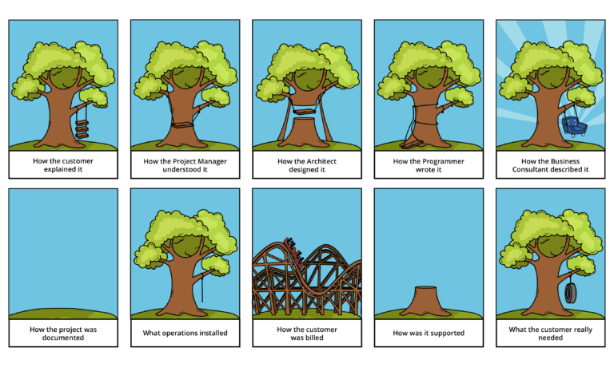

<!-- _class: titlepage -->

# Web Dev

## In Industry

---

# Learning Objectives

- Gain an insight into what it's like to be a web developer in industr.

- Learn about the software development lifecycle and explore some tools used by development teams to organise themselves.

- Complete a web dev project based on a real-world problem

---

<!-- _class: titlepage invert -->

# Working as a web developer

---

# Worknig at Mayden

- 2 years: one placement, one as a graduate.

- Working on a web-based patient management system for psychological therapies used in the NHS.

- Worked as part of a team as a "full-stack" developer -- PHP, MySQL, HTML, JavaScript and CSS.

- Developers are also software engineers: desesigning, planning, testing and releasing software.

- Often developers are detectives: we have to figure out why something has broken or, worse, how some old code works.

<!--
  Small-ish company. Meant developers could be involved in every part of the development process, excellent learning experience because you got to experience all aspects of the company which is not so easy in large firms.
  We were called Devs (developers) but we were really software engineers and sometimes detectives!
-->

---

# Case study: the diary project

- Add repeating appointments to the Diary

- Old code: user experience needs an overhaul, database schema needs updating.

- Opportunity to rewrite *some* of the system using modern technologies (react, REST API)

- But also have to compromise with time and cost.

- Clients expect the system to work the same way, even if its behaviour doesn't make sense.

<!--
    System had been around for 10 years, easier to rewrite than try to modify old code.
    Had to choose wisely what we could rewrite.
    Opportunity to use modern technologies (react, redux) and start creating a design system with reusable components
    Also had to replicate existing behaviour, e.g., appointments can only be booked if they fall in an availability slot, cannot book appointments in the past. ability to book on behalf of another user -- adds complexity and more edge cases.
-->

---

<!-- _class: image -->

<!--
  Famous cartoon about software engineering.
  It's important to gather the requirements and understand what the user needs. Often asking the user what they want isn't very effective because they may not know. (1-3)
  Sometimes there are technical limitations -- the client has been sold something which isn't possible and a compromise has te be reached. (3)
  Not much to say about (4), we've all coded here!
  It is also important to manage customers' expectations. (5 and 8)
  User and developer documentation is important (6). Have you ever returned to late night code the next day and have no idea what it does?
  Web systems are different from standalone software. Browserv are updated, libraries / features become deprecated, vulnerabilities are discovered and exploited. 9
  (10) and sometimes the customer just wanted a simple tyre swing!
-->

---

# Developer workflow

- **Planning** - break down tasks, decide on technologies, design database, API.
- **Code** - write the code, surprisingly the smallest part of being a Dev.
- **Code Review** - someone else checks over the code.
- **Test** - automated, manual, sometimes with stakeholders and users.
- **Release**

    
Plann

    
Code

    
Code review

    
Test

    
Release

<!--
    Talk about visibility: organising the postits on the board.
-->

---

# Planning

- Worked in 2 week sprints. Each team took a number of *stories* which they commit to finish.

- Stories to choose from were in priority order and requirements were already specified.

- Teams spent time *planning* each story by breaking it down into small tasks.

- If the task was complicated, we'd also spend time designing, e.g., database schema, API.

---

<h3>Create repeating appointments, front end (13 points)</h3>

As a therapist

I want to book repeating appointments

So that I can save time.

<ul>
<li>Add a repeat button to the appointment booking form</li>
<li>Options for daily, weekly and monthly repeat</li>
<li>Show a table summarising the appointments to be booked</li>
<li>Allow individual appointments to be modified from the table</li>

<!--
    Developer teams worked in sprints.
    Each sprint we would estimate how much work we'd be able to do and select work from a prioritised list.
    Work came in the form of stories with a brief description and a list of requirements.

    Talk about the example: diary project.
    Explain what are points.
-->

---

<!-- _class: postits -->

- Migrate appointment form to React.

- Add repeat button.

- Create repeat options form.

- Create appointment summary table.

- Delete button on table

- Edit button on table.

- Edit single appointment.

<!--
    We'd then plan within our team.
    We would then break work down into smaller tasks.

    Example breaks down the diary project task into smaller tasks.

-->

---

<!-- _class: two-col image -->

# Coding

## Pair programming

- *Driver* writes code, *navigator* explains what to do

- Swap roles around every half hour.

- Excellent for learning, as well as to design more efficient software.

 

## Test Driven Development

- Write tests first, which will fail, then write code to make them pass.

- Tests define behaviour so you can match tests to requirements.

- Ensures good test coverage.

<!--
    Talk about pairing and tdd.

    Idea of pairing is that the driver only needs to worry about the syntax / technicalities of coding and the navigator thinks about the bigger picture and how the program should work.
  TDD is great for things like pure functions (e.g., calculations) because it makes you think about all the edge cases. Also great for things like APIs because the tests explain how the API should work.
-->

---

# Code review

- Every line of code must be read by another developer.

- Helps spot mistakes, oversights or edge cases.

- Ensure teh code is easy to understand.

- Getting and giving feedback helps both parties become better developers.

<!--
  Another way to produce better code.
  Also helps you develop as a programmer, because you get advice on how to improve your code and get to look at how
  others do things.
-->

---

# Testing and QA

- Automated tests.

- Manual tests in *multiple browsers* and on *different screen sizes*.

- Test on a replica of the live server with real data.

- Walk through the new features with a stakeholder.

- For larger projects, customers may be willing to Beta test.

<!--
    Automated: ideally, every line of code should be covered by an automated test and all tests should run before you're allowed to put new code into production. Helps catch situations where a new feature / change broke the system somewhere else.
    Manually testing under different conditions: you don't know how the user is going to (mis)use your software. May have to support multiple (old) browsers, screen sizes, accessibility requirements (colour blindness, inverted colour scheme, screen reader)
    Replica live server: is the quality assurance (QA) test, and is designed to make sure it works in a real situation.
    Finally, the work is signed off by walking through the new features with a stakeholder.
    For larger projects, the customer may be willing to Beta test before it's released to everyone.
-->

---

# Release

- More experienced developers put the code on the live server.

- Different types of release: `hotfix`, `feature`.

- Usually outside of working hours.

- Release team make sure everything worked and must fix any issues if the release goes wrong.

<!--
    There is usually a script, or at least a procedure, and an experienced developer (or a couple of developers) do the release.
    Best to do it when the system is quiet, sometimes it needs to be taken offline, but not always. Want as fow users as possible, so the software doesnt change when they are in the middle of using it, and to reduce the amount of damage if something goes wrong.
    Releases which fix bugs are typically "hot fixes" and shouldn't change behaviour.
    New features go in feature releases and the customer should be informed.
    If the release goes wrong, the best case is that we can roll it back to a working version. This is not always possible. Say we did a big database mirgation, or people already started using the system and adding (sometimes messed up) data. In this case, you just have to push on and fix it.
-->

---

<!-- _class: titlepage invert -->

# Organising Teams

## the development workflow in large projects.

---

# Tracking Tasks

- Devs often have a large whiteboard with sections for *"To do", "In progress", "Code Review", "QA / Sign Off** and *"Done"*.

- Often a system like *Jira* is used, which tracks the status of each story and organises releases.

- Large projects always use version control, typically Git integrated with GitHub or GitLab.

- All this gives visibility to everyone involved in the development process.

---

# Git Branches

- Repo's `main` branch contains the production code.

- Each feature typically has its own branch, e.g.,
`feature/53/repeating-appointments`.

- When a feature is finished, it should be *merged* into the `main` branch.

- Actually, multiple `features` are merged into a `release` branch, and this is merged into `main`.

---

# Pull requests

- In order to merge a branch, the developer opens a *pull request* on GitHub.

- Other developers are asked to comment on the pull request during code review.

- A member of the release team will *approve* the pull request, then the feature can be merged.

---

<!-- _class: titlepage invert -->

# Case Study

## Online appointment booking

---

# The Patient Portal

The customer has requested that patients have the ability to book their own appointments online. It should work as follows:

- Therapist sends an SMS to the patient with a booking link.

- Patient clicks the link and is shown a web page with available appointments (date, time, location).

- The patient can select one appointment and will be presented with a confirmation screen.

- Once booking is successful, the appointment is added to the Therapist's diary and an appointment conficmation SMS is sent to the patient.

---

# The Patient Portal should

- Be a separate system from the main Patient Management System (but may need to communicate with it).

- Be simple to use, so that patients are not overwhelmed or discouraged from using it.

- Be accessible to all users (think colours, screenreaders, but also the fonts and language used).

- Work on multiple screen sizes (research shows users prefer to complete bookings and purchases on a PC, even if they started on their phone).

---

# Your Task

In groups, pairs or individually, plan out the Patient Portal.

- **Flow-chart**: create a flow-chart showing how the system will work and how the Patient Portal will interact with the main Patient Management System.

- **Write User Stories**

  - Use the template *"As a ..., I want ..., So that ..., Requirements"* to specify requirements.
  - Think about dependencies *(e.g., confirmation page depends on booking page)*.
  - Thnk about priorities *(e.g., allowing the client to customise the style of their page is less important than getting the system working)*.

At the end of the session, please showcase your work!
---

<h3>Patient Appointment Booking: SMS (2 points)</h3>

As a therapist

I want to send an appointment booking link to my patient

So that I can save myself time and give my patient more control and flexibility over their appointment.

<ul>
<li>Admin setting to enable patient appointment booking links via SMS.</li>
<li>button to the patient's page to trigger an appointment booking SMS.</li>
<li>Confirmation dialog showing the message to be sent and patient's contact number.</li>
<li>confirmation message to the user that a message was sent.</li>
<li>Log on the patient's record that the message was sent.</li>
<li>Customisable template for SMS wording.</li>
</ul>

<!--
    Here is an example story.
-->

---

<!-- _class: titlepage -->

# Present Your Work

# Please share your flowcharts and stories

---

<!-- _class: titlepage -->

# Questions?

